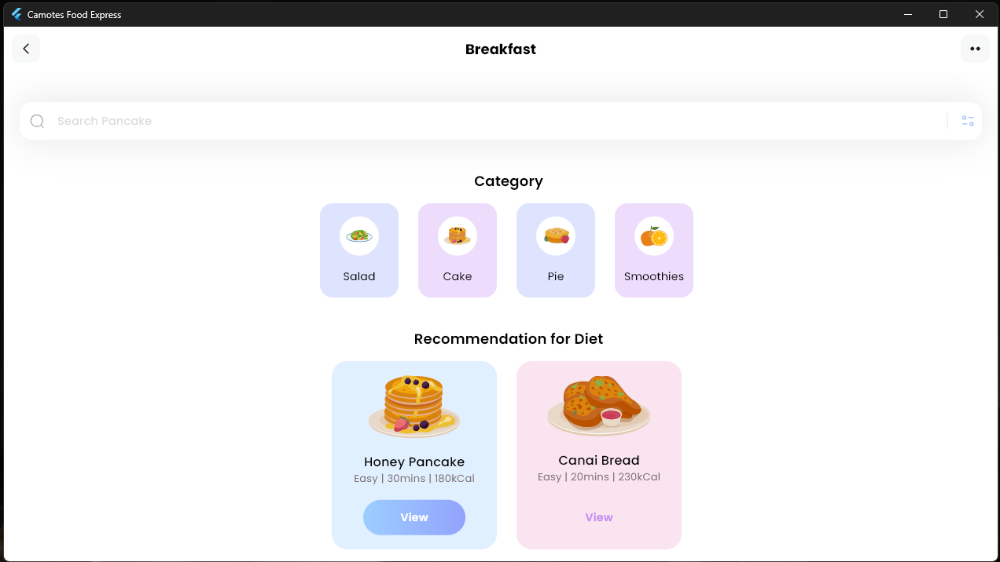
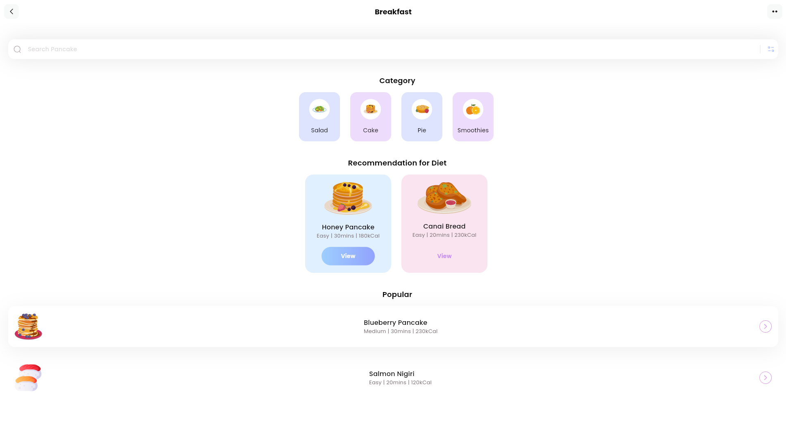
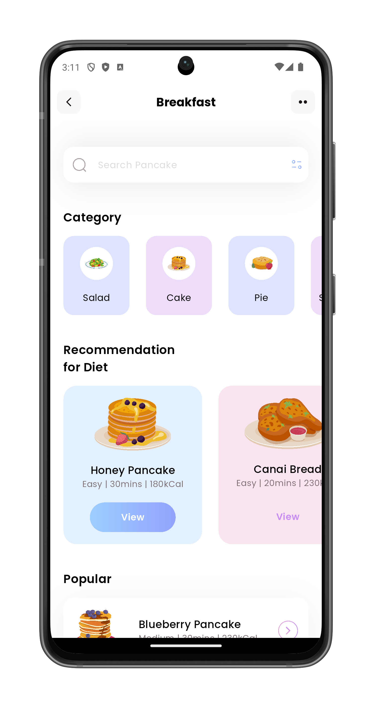

# Camotes Food Express 🍽️

**Simple. Fast. Delicious.**  
A sleek and responsive Flutter app for discovering and ordering food online.

---

## ✨ Features

- 🍳 Browse meals by category (e.g., Salad, Cake, Pie)
- 📖 View diet recommendations with calories, duration and difficulty
- 🔍 Clean search interface
- 📱 Responsive design with smooth horizontal and vertical lists
- 🎯 Built with modern Flutter practices and scalable structure

---

## 🧱 Built With

- **Flutter** (UI framework)
- **Dart** (programming language)
- **SVG support** via `flutter_svg`
- Modular UI widgets & custom model classes

---

## 📦 Platforms Supported

- 🕹️ Web (HTML5)
- 💻 Windows
- 📱 Android

---

## 📸 Screenshots

> Screenshots from each platform

### 🖥️ Windows

### 🌐 Web

### 📱 Android

| Portrait                                                         | Landscape                                                             |
|------------------------------------------------------------------|-----------------------------------------------------------------------|
|  |  |

---

## 🌐 Live Demo

- 🔗 **Web (GitHub Pages):**  
  [Demo](https://omnitechphilippines.github.io/camotes-food-express/)

---

## 📦 Download Releases

- 💻 **Windows (.7z):**  
  [Download for Windows v1.0.0+1](https://github.com/omnitechphilippines/camotes-food-express/releases/download/v1.0.0%2B1/windows-release-v1.0.0%2B1.7z)

- 📱 **Android (.apk):**  
  [Download for Android v1.0.0+1](https://github.com/omnitechphilippines/camotes-food-express/releases/download/v1.0.0%2B1/app-release-v1.0.0%2B1.apk)

- 🌐 **Web build (.7z):**  
  [Download Web Build v1.0.0+1](https://github.com/omnitechphilippines/camotes-food-express/releases/download/v1.0.0%2B1/web-release-v1.0.0%2B1.7z)

> You can also find all versions in the [Releases Page](https://github.com/omnitechphilippines/camotes-food-express/releases)

---

## 🚀 Future Roadmap

This is the foundation of a fully functional online food ordering app, to be expanded into:

- 🛒 Cart and checkout flow
- 📍 Location-based delivery
- 🔐 User authentication
- 📦 Order tracking
- 🌐 Backend integration (Firebase or custom API)
- 🎨 Admin panel for food management

